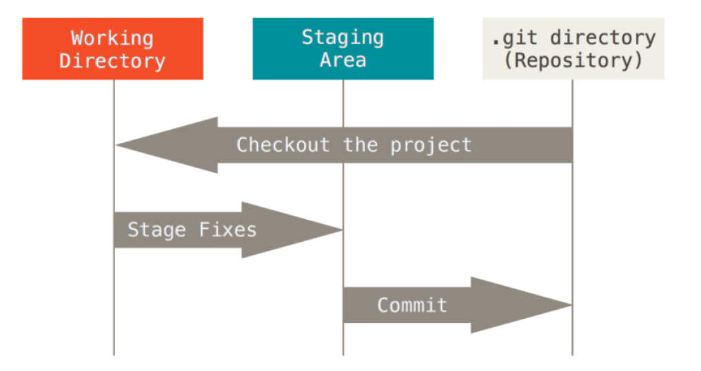
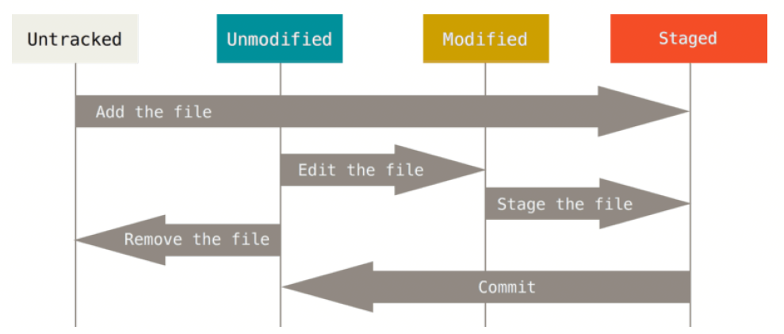

# Git cheat sheet

1. https://git-scm.com/book/en/v2
2. https://git-scm.com/docs/gittutorial
3. https://git-scm.com/docs
4. https://github.github.com/training-kit/downloads/github-git-cheat-sheet/

- **Working tree, staging area, and Git directory**

- **The lifecycle of the status of your files**

## 1. repo

### create local repo

	git init [project-name]

### download repo

	git clone [url]

## 2. files operation

### stage

	git add [file]

### commit

	git commit -m "comment"

### show file status

	git status

### delete&stage file

	git rm [file]

### delete cached file, keep local file

	git rm --cached [file]

### modify file name

	git mv [file-original] [file-renamed]

## 3. sync

### download

	git fetch

### merge

	git merge

### upload

	git push

### download&merge

	git pull

## 4. tag

### show tag

	git tag

### show tag

	git tag -l "v1.8.5*"

### create tag

	git tag v1.4-lw

	# share tag to remote
	git push origin v1.5

	# share all tags to remote
	git push origin --tags

### show tag detail

	git show v1.4-lw

### create tag lately

	$ git log --pretty=oneline
	15027957951b64cf874c3557a0f3547bd83b3ff6 Merge branch 'experiment'
	a6b4c97498bd301d84096da251c98a07c7723e65 beginning write support
	0d52aaab4479697da7686c15f77a3d64d9165190 one more thing
	6d52a271eda8725415634dd79daabbc4d9b6008e Merge branch 'experiment'
	0b7434d86859cc7b8c3d5e1dddfed66ff742fcbc added a commit function
	4682c3261057305bdd616e23b64b0857d832627b added a todo file
	166ae0c4d3f420721acbb115cc33848dfcc2121a started write support
	9fceb02d0ae598e95dc970b74767f19372d61af8 updated rakefile
	964f16d36dfccde844893cac5b347e7b3d44abbc commit the todo
	8a5cbc430f1a9c3d00faaeffd07798508422908a updated readme

	git tag -a v1.2 9fceb02

	$ git tag
	v0.1
	v1.2
	v1.3
	v1.4
	v1.4-lw
	v1.5

### delete tag

	git tag -d 1.3.2

	# delete remote tag
	git push origin :refs/tags/1.3.2

### checkout tag

	git checkout 2.0.0

## 5. branch

### show branch

	git branch

### show branch detail

	git branch -v

### create branch

	git branch testing

### switch branch

	git checkout testing

### create&switch to branch

	git checkout -b testing

### merge branch(merge hotfix to master)

	git checkout master
	git merge hotfix

### delete branch

	git branch -d hotfix
	git push origin :hotfix
