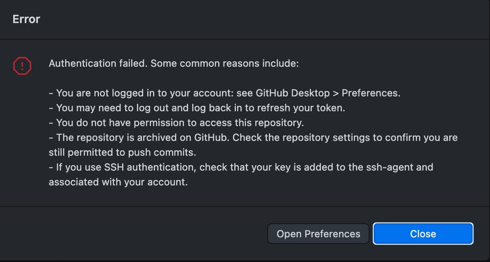

## Untrack files already added to git repository based on .gitignore

http://www.codeblocq.com/2016/01/Untrack-files-already-added-to-git-repository-based-on-gitignore/

### 1. Commit all your changes

### 2. Remove everything from the repository

    git rm -r --cached .

### 3. Re add everything

    git add .

### 4. Commit

    git commit -m ".gitignore fix"

## Igore file globally

https://stackoverflow.com/questions/18393498/gitignore-all-the-ds-store-files-in-every-folder-and-subfolder

    echo ".DS_Store" >> ~/.gitignore_global
    echo "._.DS_Store" >> ~/.gitignore_global
    echo "**/.DS_Store" >> ~/.gitignore_global
    echo "**/._.DS_Store" >> ~/.gitignore_global
    git config --global core.excludesfile ~/.gitignore_global

## Set ssh for github

https://github.com/desktop/desktop/issues/2085

    git config --global url."git@github.com:".insteadOf https://github.com/

## Adding an existing project to GitHub using the command line

https://docs.github.com/en/github/importing-your-projects-to-github/adding-an-existing-project-to-github-using-the-command-line

https://forum.freecodecamp.org/t/push-a-new-local-branch-to-a-remote-git-repository-and-track-it-too/13222

## Github add ssh key(Error fix)

https://docs.github.com/en/github/authenticating-to-github/generating-a-new-ssh-key-and-adding-it-to-the-ssh-agent

https://gist.github.com/Tamal/1cc77f88ef3e900aeae65f0e5e504794

## Github clear history

https://gist.github.com/stephenhardy/5470814

    -- Remove the history from 
    rm -rf .git

    -- recreate the repos from the current content only
    git init
    git add .
    git commit -m "Initial commit"

    -- push to the github remote repos ensuring you overwrite history
    git remote add origin git@github.com:<YOUR ACCOUNT>/<YOUR REPOS>.git
    git push -u --force origin master
