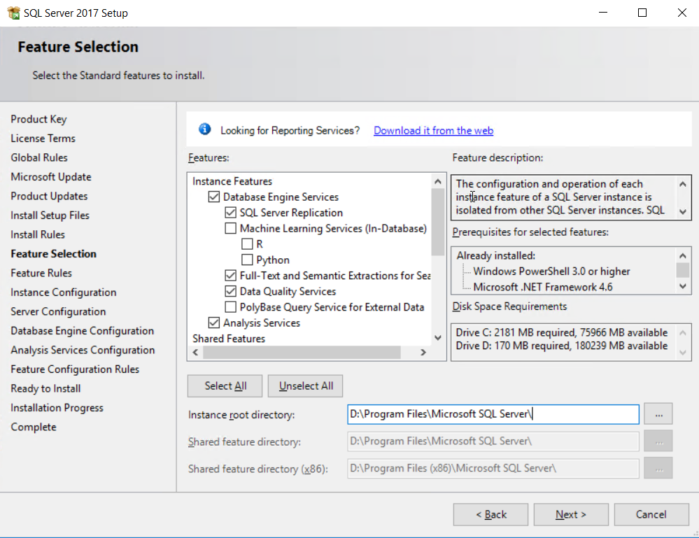
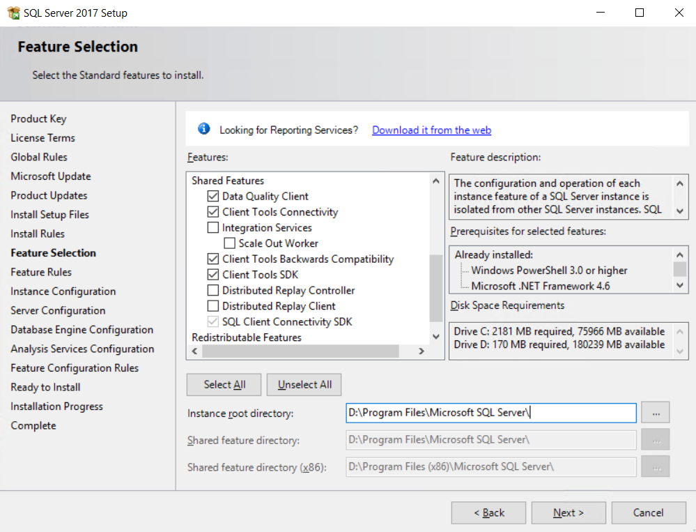

## 1. MSSQL features
 

## 2. Parameter setup

### 2.1 max server memory

	sp_configure 'show advanced options', 1;
	GO
	RECONFIGURE;
	GO
	sp_configure 'max server memory', 4096;
	GO
	RECONFIGURE;
	GO
	sp_configure 'show advanced options', 0;
	GO
	RECONFIGURE;

### 2.1 max degree of parallelism

	-- it may not necessary
	-- if the instance is migrated from an old server, keep it the same with the old sever
	-- 
	sp_configure 'show advanced options', 1;
	GO
	RECONFIGURE WITH OVERRIDE;
	GO
	sp_configure 'max degree of parallelism', 1;
	GO
	RECONFIGURE WITH OVERRIDE;
	go
	sp_configure 'show advanced options', 0;
	GO
	RECONFIGURE WITH OVERRIDE;
	GO

## 3. Backup Location

	X:\MSSQL_BACKUP
